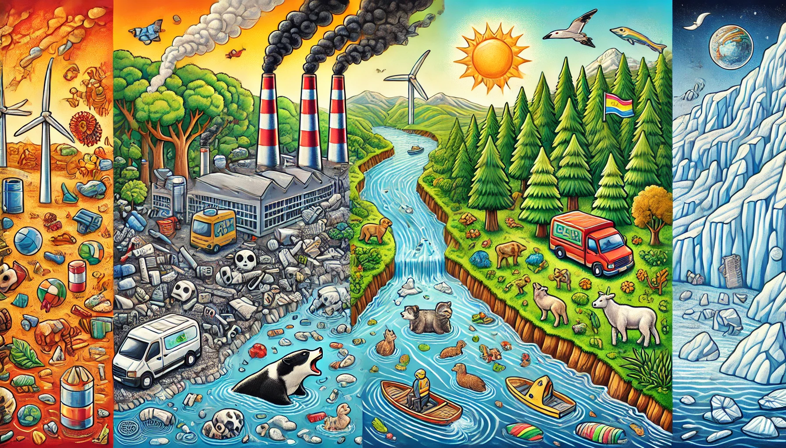

# Retos Ambientales

# Indice

  1. [Introducción](introduccion.md)
  2. [Principales retos ambientales y sociales](retos.md)
  3. [Impacto de los actuales problemas medioambientales](impacto.md)
  4. [Medidas y acciones para minimizar los impactos ambientales](medidasyacciones.md)
  5. [Conclusión](conclusion.md)
  6. [Mapa conceptual](mapa.md)
  7. [Glosario](glosario.md)
  8. [Referencias](referencias.md)

### Autor: Alejandro Benítez Quidato
