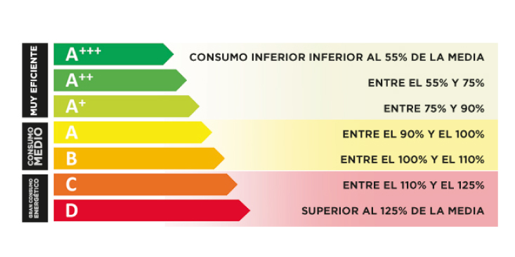

## La contaminación de cada español según la INE

## La etiqueta energética

La etiqueta energética es un adhesivo o placa que tienen la mayoría de electrodomésticos y que sirve para identificar el grado de eficiencia energética de cada uno, es decir, qué aparato consume más o menos energía.

Que los electrodomésticos tengan una etiqueta energética de alto nivel puede suponer un ahorro de consumo energético importante, así como una mayor aportación al desarrollo medioambiental.

Esta etiqueta energética cuenta con 7 niveles diferentes que identifican la eficiencia energética de un aparato, aunque desde marzo de 2021 se introdujo una nueva etiqueta siguiendo las directrices de la Unión Europea.

