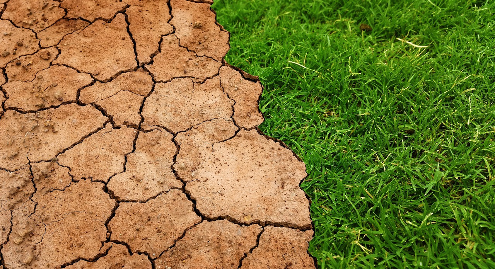

## ¿Qué es el clima?

El clima se define como el estado medio de las condiciones metereológicas en un lugar determinado considerando un periodo de largo de tiempo, según la **Organización Metereológica Mundial (OMM)**, el perio de promedio habitual es de 30 años.

## La predicción de la ONU para el 2050

Según un informe de la ONU, en el 2050 una 4.000 millones de personas vivirá en tierras desertificadas, principalmente en África y el sur de Asia, y cofirma que la contaminación del aire mata ya **7 millones de personas cada año**

