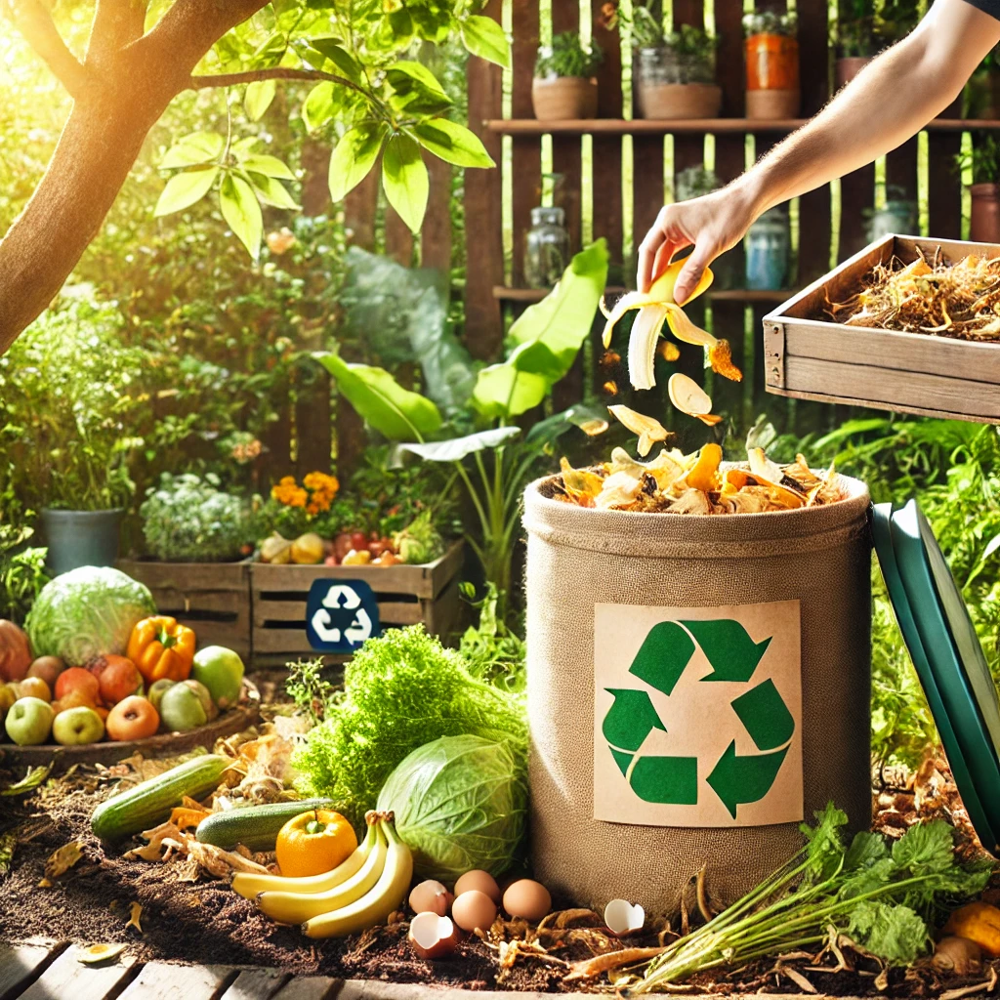

## El compostaje como medida

Cada año en todo el mundo se pierden o se desperdician 1.300 millones de toneladas de alimentos, de acuerdo con el índice de desperdicio de alimentos del Programa de las Naciones Unidas para el Medio Ambiente. Una solución planteada puede ser desechos orgánicos adecuados que generamos en nuestra vida diaria, esto reduciría la dependencia de fertilizantes químicos, ayudar a recuperar la fertilidad del suelo y mejorar la retención de agua y la llegada de nutrientes a las plantas. 

# EIA

Una **EIA (Evaluación de impacto ambiental)** es un procedimiento por el cual se estudian los efectos significativos que un determinado plan, programa o proyecto puede suponer sobre el ambiente, antes de su aprobación o autorización por el organo competente. 
