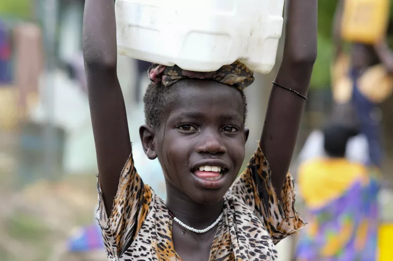

## Los países mas poblados

  1. India, 1.441 millones 
  2. China, 1.425 millones
  3. Estados Unidos, 341 millones
  4. Indonesia, 279 millones
  5. Paquistán, 245 millones
  6. Nigeria, 229 millones
  7. Brasil, 217 millones
  8. Bangladesh, 174 millones
  9. Rusia, 143 millones
  10. Etiopía, 129 millones

## El consumo de agua

La superficie del planeta Tierra es un 70% agua, pero de la ingente cantidad de agua que hay en el planeta, solo un 2% resulta apta para el consumo humano. Resulta alarmante que el consumo de agua siga creciendo a un ritmo exponencial, cada dia desperdiciamos una cantidad desorbitada de agua potable. Aunque haya suficiente agua para atender las necesidades de toda la humanidad, lo cierto es que esta distribución es muy desigual, alrededo de 2.200 millones de personas en todo el mundo no cuenta con servicios de agua potable gestionados de manera segura.

##  Un agente de contaminación física

## La contanimación lumínica
